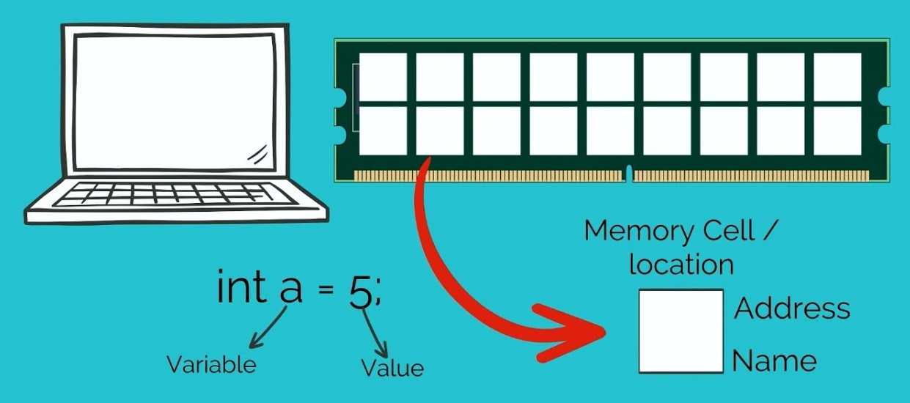

# Variables

# **Unveiling the Core of Programming: The Nature of Variables**

In the vast realm of computer programming, where lines of code shape the digital world around us, there exists a fundamental concept that serves as the cornerstone of this virtual universe: variables. These seemingly unassuming entities lie at the heart of every program, holding the very essence of data that drives interactivity and functionality. As we embark on this exploration, we will not only dive into the art of variable declaration in JavaScript but also unravel the profound essence of variables across the programming landscape.

# What is a Variable

At the heart of programming, variables are foundational elements that enable us to work with data in an organized manner. In essence, variables are containers that hold valuable information, allowing programs to manipulate and process data efficiently.

A variable can be thought of as a labeled box. Imagine you have a collection of items, and each item needs a specific place to be stored. In this scenario, the labeled box serves as the variable, providing a designated spot to hold a particular piece of data.


In programming, these pieces of data can be anything – numbers, text, dates, and more. Variables allow us to name and store these data points so that we can easily reference and manipulate them within our code.

Here are a few examples in pseudo code to illustrate the concept of variables:

```
name <- "John"       // Store "John" inside the variable named "name"
age <- 25            // Store 25 inside the variable named "age"
isStudent <- true    // Store true inside the variable named "isStudent"
```

In this example, the **`<-`** symbol indicates that we're storing a value inside a variable. It's like placing an item inside the labeled box. The variable **`name`** now holds the value "John", **`age`** holds the value 25, and **`isStudent`** holds the value **`true`**.

Variables enable us to give context to data and facilitate interactions within a program. For instance, consider the following code snippet where variables are used later in the code:

```
showUser("John", 25, true);
```

This code snippet represents the data stored in variables and how they can be used to pass information to a function. Now, let's visualize the final result, which represents the data stored in variables:

```
+---------------+--------+---------+
|     Name      |  Age   | Student |
+---------------+--------+---------+
|     John      |   25   |   Yes   |
+---------------+--------+---------+
```

This visualization showcases how variables hold meaningful data and contribute to the functionality of a program. With a basic understanding of variables, let's delve into the intricate world of computer memory to uncover how these variables are stored and managed. Later, we'll also explore the various ways we can declare them in JavaScript.

# **Storing Variables in Computer Memory: The Address of Data**

As we've established, variables serve as labeled boxes that hold data. But how does a computer remember and access these boxes? To answer that, we need to dive into the world of computer memory.

### **Memory Slots and Addresses:**

Think of computer memory as an extensive grid of memory slots, similar to houses in a neighborhood. Each memory slot has an address, much like houses have street numbers. When you declare a variable, you're essentially reserving a memory slot and assigning it a unique address.

| **Address** | **Variable Name** | **Data** |
| --- | --- | --- |
| 0x001 | age | 25 |
| 0x002 | name | "John" |
| 0x003 | isStudent | true |

In this example, each variable is assigned a memory address. The data associated with each variable is stored in the corresponding memory slot, making it efficient to access and manipulate the data during program execution. Just as each house in a neighborhood has a specific address for mail delivery, each variable has a specific memory address for data retrieval



### **Assigning Values to Memory Slots:**

When you store data in a variable, you're placing the value inside a specific memory slot. Just as you'd put your family name badge on a house, the computer associates the variable name with a memory address. This process is known as variable binding, and it's a crucial aspect of how variables are managed in computer memory.

Here's how variable binding works in more detail:

1. **Declaration and Placeholder:** When you declare a variable in your code, you're essentially creating a placeholder for a value. For instance, consider the pseudo code:
    
    ```
    
    Declare age // variable has been declared
    ```
    
2. **Binding with Assignment:** After declaration, you can assign a value to the variable, which binds the variable name to a memory address. In pseudo code, this could look like:
    
    ```
    
    age <- 25
    ```
    
    At this point, the computer reserves memory space for the **`age`** variable and associates it with a specific memory address.
    
3. **Memory Address "House Number":** The memory address acts as a unique identifier, much like a "house number" for the data stored in memory.
4. **Using Variables:** When you reference the variable in your code, the programming language's engine looks up the variable name to find the corresponding memory address. This retrieval allows the computer to access or modify the stored value.
5. **Lifetime:**  When a variable is not used anymore, its binding may be released, freeing up memory resources.

The variable name acts as a bridge between the data type specified in the program and the memory slot's address in the computer's hardware. This binding process enables code to interact with memory efficiently, promotes readability by providing meaningful names for data storage locations, and forms the foundation for working with variables across programming languages.

### **Data Retrieval**

When your program needs to use a variable's value, it references the memory address assigned to that variable. This is akin to a postman delivering mail to a specific house based on its address. By accessing the memory address, the computer can swiftly retrieve the stored data and perform operations on it.

### **Efficient and Organized**

The organized nature of memory addresses ensures efficient data storage and retrieval. Just like a well-structured neighborhood with clear addresses, computer memory's systematic layout allows for streamlined data management and manipulation.

By understanding how variables are stored in computer memory, you're peering into the inner workings of programs. Each variable is more than just a label; it's a carefully allocated memory slot that holds data vital to your code's functionality. This insight sets the stage for exploring the various ways of declaring variables in JavaScript, which we'll delve into next.

# **Analogizing the Concept: Houses, Family Badges, Envelopes, and the Postman**

Now that you grasp the essence of how variables are stored in computer memory, let's delve deeper into an analogy that ties everything together. Imagine you're in charge of a sprawling neighborhood, and you need to manage an intricate system of delivering messages and items to various families.

In this analogy, think of the neighborhood as your computer's memory, and the houses within it as memory slots. Each house has a unique address, just like each memory slot has a distinct memory address. These houses represent where valuable information can be stored and retrieved.

Now, let's introduce families – a crucial aspect of our analogy. Families in this neighborhood are like variables in your program. Each family is distinct, with its own characteristics and members. Similarly, each variable is unique, with its own data and purpose.

The names of these families, displayed prominently on badges by their house doors, are akin to variable names. Just as each family name helps you identify and communicate with the residents, variable names allow you to access and manipulate the data within.

But what about the items you need to deliver to these families? Enter the envelopes. Envelopes containing messages, valuables, or anything else you need to share with the families correspond to the values stored within variables. Just as each envelope has specific contents, each variable holds a particular piece of data.

Now, here comes the postman – the key player in our analogy. The postman is like the language compiler, interpreter, or runtime of your programming language. They understand the neighborhood, know the family names (variable names), and have a map to locate the houses (memory addresses).

When you want to access data from a variable, it's as if you're sending the postman to a specific house. The postman swiftly navigates the neighborhood using the family name (variable name), reaches the right house (memory slot), and retrieves the envelope (value) you need. This process mirrors how the compiler or interpreter locates the memory address associated with a variable's name and fetches its stored data.

In this intricate analogy, you've witnessed the interplay between houses as memory slots, families as variables, family names as variable names, envelopes as values, and the postman as the language compiler/interpreter/runtime. Just as the postman ensures timely delivery, your understanding of these concepts ensures your code operates smoothly and efficiently.

| **Analogy Component** | **Real-World Equivalent** |
| --- | --- |
| Neighborhood | Computer's Memory |
| Houses | Memory Slots |
| Families | Variables |
| Family Badges | Variable Names |
| Envelopes | Variable Values |
| Postman | Compiler/Interpreter/Runtime |

With this analogy in mind, you're now equipped to envision the intricate relationship between variables, memory addresses, and the language processing that powers your programs. By embracing this perspective, you're well-prepared to navigate the intricate world of programming with confidence and creativity.

# **Unveiling the Core of JavaScript Variable Declaration**

Programming languages serve as the foundation of our digital world, and among them, JavaScript stands out as a versatile language that drives the interactivity of the web. At the heart of JavaScript lies a fundamental concept: variable declaration. In this exploration, we will delve into the specific ways of declaring variables in JavaScript and how each approach influences the behavior and structure of your code.

*Before moving on, shortly about some concepts we didn’t cover yet* 
**Block scope**: Variables with block scope are limited to being accessible within specific blocks like if conditions, switch cases, or loops.
**Function Scope**: variables with functional scope are accessible only within the function they are declared in.
**Hoisting:** Variables are moved to the top of their functional scope during compilation, allowing them to be used before declaration.

### **Explicit Declarations: var, let, and const**

Explicit declaration involves using keywords like **`var`**, **`let`**, or **`const`** to define variables. This approach provides clarity by specifying the scope, behavior, and intended usage of the variable.

### var Declaration:

The **`var`** keyword represents an older way of declaring variables, before es6. It's function-scoped and hoisted to the top of its scope. This hoisting feature allows you to use the variable before declaring it, potentially leading to unexpected behavior. Variables declared with **`var`** are also reassignable, which can make your code less clear and more prone to bugs.

**How to declare**

```jsx
var a = 10;
console.log(a); // 10
```

Hoisting comes in (about it in a different article, just be aware of this behaviour)

```jsx
console.log(a); // undefined
var a = 10;
console.log(a); // 10
```

**Behavior:**

- Hoisted: Yes
- Scope: Function
- Reassignable: Yes

### let Declaration:

The **`let`** keyword represents a modern approach. It's block-scoped and not hoisted, ensuring that variables are only accessible after they are declared. **`let`** variables are suitable for scenarios where reassignment is expected.

**How to declare**

```jsx
let b = 20;
console.log(b); // 20
```

Not hoisted

```jsx
console.log(b); // ReferenceError: Cannot access 'b' before initialization
let b = 20;
console.log(b); // 20
```

**Behavior:**

- Hoisted: No
- Scope: Block
- Reassignable: Yes

### const Declaration:

The **`const`** keyword is also modern and block-scoped. Once assigned, **`const`** variables cannot be reassigned.

**How to declare**

```jsx
const c = 30;
console.log(c) // 30;

```

Not reassignable

```jsx
const c = 30;
c = 40; // Error: Assignment to constant variable
```

**Behavior:**

- Hoisted: No
- Scope: Block
- Reassignable: No

### Implicit Declaration: Global Variables

Implicitly declaring variables without **`var`**, **`let`**, or **`const`** creates global variables. However, this can lead to issues, as global variables can cause unexpected behavior and make code maintenance challenging.

**Examples:**

```jsx
x = 20
```

```jsx
function example() {
  d = 50; // Creates a global variable
}
example();
console.log(d); // 50 (accessible globally)
```

**Behavior:**

- Hoisted: Yes
- Scope: Global (Avoid)
- Reassignable: Yes

### **The Impact on Code Quality and Readability**

Choosing the appropriate way to declare variables is not just about adhering to syntax rules; it has a significant impact on your code's quality and readability. Using explicit declarations like **`let`** and **`const`** helps make your intentions clear. When you use **`const`**, it signals that a value won't change, promoting stability. Conversely, when you choose **`let`**, it indicates that a value might change, aiding in understanding the flow of your code.

As you navigate variable declaration, keep these guidelines in mind:

- When declaring variables, opt for **`let`** or **`const`** (especially in modern environments) to enhance code clarity and maintenance.
- Ask yourself: *"Will this variable be reassigned?"* If the answer is “yes”, choose **`let`**. In scenarios where reassignment isn't expected, embrace **`const`** for its added stability.

Incorporating these practices not only refines your code but also aids in conveying your intentions and logic to fellow programmers. By adhering to these principles, you elevate your codebase and contribute to a more readable and efficient programming ecosystem.

| **Declaration Type** | **Scope** | **Hoisting** | **Reassignable** |
| --- | --- | --- | --- |
| **`var`** | Function | Hoisted | Yes |
| **`let`** | Block | Not hoisted | Yes |
| **`const`** | Block | Not hoisted | No |
| Implicit Global | Global (Avoid) | Hoisted | Yes |

### Effective Variable Naming and Restrictions

Creating clear and meaningful variable names is a critical aspect of writing clean and maintainable code. Proper naming not only enhances code readability but also aids collaboration among developers. In this section, we will explore essential practices for naming variables in JavaScript, as well as the restrictions and guidelines you should keep in mind. By following these practices, you'll not only make your code more comprehensible but also contribute to the overall quality of your programming projects.

**Variable Naming Conventions:**

**Descriptive Names**: Choose names that reflect the purpose of the variable. A descriptive name helps anyone reading your code understand the variable's role without needing to dive into the details of its usage.

```jsx
// Poor naming
let x = 5; 

// Descriptive naming
let numberOfStudents = 5;
```

**Camel Case**: Use camel case to join words within a variable name. Start with a lowercase letter and capitalize the first letter of each subsequent word.

```jsx
const fullName = "John Doe";
let itemCount = 10;
```

**Avoid Single Letters**: Unless it's a common convention (like **`i`** for loop counters), avoid using single-letter variable names as they lack context.

**Use Meaningful Abbreviations**: If a term is commonly understood by its abbreviation, you can use it for brevity. However, avoid overly cryptic abbreviations.

```jsx
let msg = "Hello, World!"; // Unclear abbreviation
let message = "Hello, World!"; // Clear and meaningful
```

**Case Sensitivity**: JavaScript is case-sensitive, so **`myVar`** and **`myvar`** are distinct variables.

```jsx
let myVar = 5;
let myvar = "Different variable";
```

**Variables naming restrictions:
Start with a Letter:** Variable names must commence with a letter (A-Z, a-z) or an underscore (_). They can be trailed by letters, numbers, or underscores. Here's an example:

```jsx
let _privateVariable = "Access restricted";
let 123abc = "Invalid variable name"; // Invalid starting with a number
```

**Avoid Reserved Keywords:** It's crucial to avoid using reserved keywords as variable names. Keywords are words that hold special meanings in JavaScript and are used to define the language's syntax. Using them as variable names lead to errors. For instance:

```jsx
let let = "Avoid using keywords as variable names"; // Invalid use of keyword "let"
let function = "This will cause confusion"; // Invalid use of keyword "function"
```

**No Spaces or Special Characters:** Variable names shouldn't encompass spaces or special characters except for underscores. This maintains consistency and makes it easier to reference variables in your code. Consider the following:

```jsx
let my variable = "Invalid variable name"; // Contains space (invalid)
let my-variable = "Invalid variable name"; // Contains hyphen (invalid)
```

**Start with a Number:** Variables cannot initiate with a number. They must start with a letter or an underscore. Here's an example of an incorrect variable name:

```jsx
let 123abc = "Invalid variable name"; // Invalid starting with a number
```

**Numbers Only:** Variables shouldn't solely consist of numbers. They need to include letters or underscores. Here's an example of an inappropriate variable name:

```jsx
let 123 = "Invalid variable name"; // Invalid consisting of numbers only
```

By adhering to the naming conventions and avoiding common errors we listed, you can create code that's easier to understand and less error-prone

# **Why Do We Need Variables?**

In the early days of computer programming, particularly during the era of assembly languages, the concept of variables as we understand them today was notably absent. Programming at this level required direct manipulation of memory addresses and registers within a computer's hardware architecture. However, this approach introduced several challenges and limitations, prompting the necessity for a more organized and abstract way of managing data.

In assembly programming, the task of storing and manipulating data demanded an intricate understanding of the computer's hardware architecture. Programmers were required to work directly with memory addresses and raw values, leading to code that heavily relied on specific hardware configurations. This lack of abstraction not only made programming arduous and error-prone but also hindered the portability of code across various computer systems.

The absence of variables meant that code lacked the convenience of meaningful names to represent data, making it arduous to discern the purpose and context of different data points. Programmers were compelled to manually manage memory locations, often necessitating the calculation of offsets for data storage. This invariably resulted in complex and challenging-to-maintain code.

Consider a seemingly straightforward operation like adding two numbers in an assembly context. This operation required specifying memory addresses, loading values from those addresses into registers, performing the addition, and then storing the result back in memory – all accomplished without the aid of variable names.

As programming languages evolved, higher-level languages like Fortran and ALGOL emerged, introducing the revolutionary concept of variables to address these inherent challenges. Variables served as named containers for data, significantly enhancing the human-readability and maintainability of code. This transformative shift from memory addresses to variable-based data representation marked a pivotal moment in programming history.

The advent of variables not only facilitated better code organization but also streamlined debugging processes and facilitated improved collaboration among programmers. This foundational development paved the way for advanced programming paradigms, such as structured programming and object-oriented programming. It also led to the creation of modern programming languages, offering higher levels of abstraction that cater to the diverse needs of today's software development landscape.

# **Conclusion and Summary**

In this journey through the realm of programming and data handling, we've delved deep into the essence of variables. These foundational building blocks play a pivotal role in crafting the intricate web of instructions that power our digital world. From their humble origins in the era of assembly languages, where raw memory addresses ruled the programming landscape, to the modern paradigms of languages like JavaScript, variables have revolutionized the way we approach coding.

We embarked on an exploration of variables, uncovering their vital role in storing and managing data. We likened them to houses with distinct addresses, where each address corresponds to a memory slot within a computer's architecture. These houses hold the treasures of data, encapsulating values that drive the functionality of programs.

As we delved into the specifics of JavaScript variable declaration, we unveiled the power of explicit declarations like **`var`**, **`let`**, and **`const`**. Each of these declarations serves a distinct purpose, influencing the scope, hoisting behavior, and reassignability of variables.

| **Declaration** | **Scope** | **Hoisting** | **Reassignable** |
| --- | --- | --- | --- |
| **`var`** | Function | Yes | Yes |
| **`let`** | Block | No | Yes |
| **`const`** | Block | No | No |
| Implicit (without **`var`**, **`let`**, **`const`**) | Global (Avoid) | Yes | Yes |

With an understanding of variable naming practices, we learned that naming is not merely a convenience, but a cornerstone of code clarity and maintainability. We explored historical contexts, harkening back to the days when programming was synonymous with memory addresses and registers. The transition from those arduous beginnings to the high-level languages we use today, like JavaScript, demonstrates the profound impact of variables on code organization, readability, and collaborative development.

Variables have empowered programmers to channel their creativity and innovation into crafting efficient and robust solutions. They've enabled us to harness the capabilities of machines to transform ideas into reality. With each line of code, we paint a picture of logic and data manipulation, and variables provide the canvas on which this masterpiece is crafted.

As we conclude our exploration, we leave you with the reminder that variables are more than abstract concepts – they're the very threads that weave the tapestry of our digital world. The next time you declare a variable, envision the houses and addresses, the families and badges, and recognize the immense journey that transforms your code into functional reality.